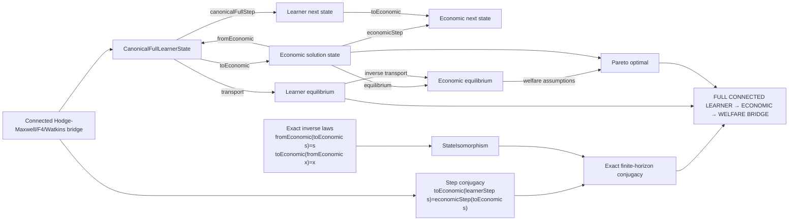
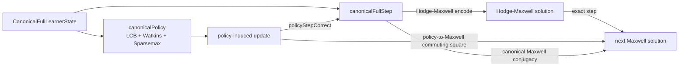

# Exact learner–economic–welfare connected bridge

The proof path is semantic: the existing Hodge-Maxwell/F4/Watkins theorem supplies exact learner dynamics; the economic theorem supplies an actual state isomorphism and step conjugacy; welfare is then transported through the economic equilibrium relation.

Canonical Agda nodes:

- `megaEconomicSolutionStateIsomorphism`
- `megaEconomicSolutionStepConjugacy`
- `megaEconomicSolutionEquilibriumTransport`
- `connectedCanonicalLearnerEconomicWelfareCompositionTheorem`
- `connectedHodgeMaxwellLearnerEconomicWelfareBridge`

The composition is conditional on the supplied economic interpretation, inverse laws, step conjugacy, equilibrium transport, and welfare implication; it does not identify arbitrary learners with economies.

## Policy–Hodge-Maxwell update seam

The new Agda seam is `policyHodgeMaxwellUpdateSeam`, with the canonical specialization `policyHodgeMaxwellCanonicalUpdateSeam`. The specialization proves that if the supplied policy-induced update is extensionally the canonical learner step, then the existing Maxwell step conjugacy transports that update exactly to the Hodge-Maxwell solution step.

This closes the graph edge that was previously only described as a missing boundary. It is still conditional: the graph does not infer that every LCB/Watkins/Sparsemax readout induces the learner transition. `policyStepCorrect` is the explicit proof obligation for that computational interpretation.
