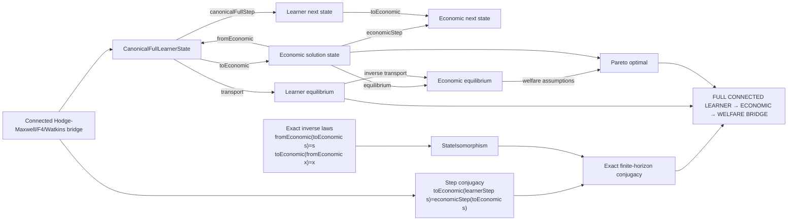

# Exact learner–economic–welfare connected bridge

The proof path is semantic: the existing Hodge-Maxwell/F4/Watkins theorem supplies exact learner dynamics; the economic theorem supplies an actual state isomorphism and step conjugacy; welfare is then transported through the economic equilibrium relation.

Canonical Agda nodes:

- `megaEconomicSolutionStateIsomorphism`
- `megaEconomicSolutionStepConjugacy`
- `megaEconomicSolutionEquilibriumTransport`
- `connectedCanonicalLearnerEconomicWelfareCompositionTheorem`
- `connectedHodgeMaxwellLearnerEconomicWelfareBridge`

The composition is conditional on the supplied economic interpretation, inverse laws, step conjugacy, equilibrium transport, and welfare implication; it does not identify arbitrary learners with economies.