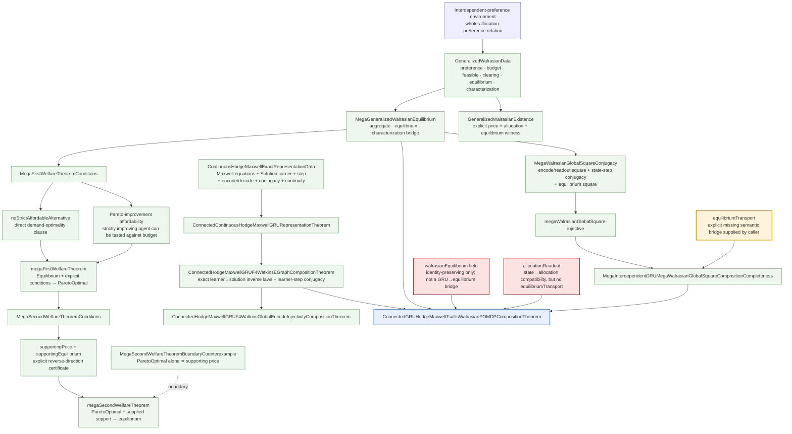

# Mega-interdependent GRU–MegaWalrasian composition completeness



## Dependency findings

The welfare layer has two different kinds of generality.

`MegaFirstWelfareTheoremConditions` is a genuinely generalized demand-side theorem schema: preference, budget, feasibility, equilibrium, and strict/weak preference are arbitrary relations over the declared carriers. It directly represents heterogeneous agents and whole-allocation/interdependent preferences. The theorem proves Pareto optimality from an explicit no-strict-affordable-alternative condition plus the affordability of the strictly improving agent in any proposed Pareto improvement.

`MegaSecondWelfareTheoremConditions` is not a generalized economic derivation of the classical Second Welfare Theorem. It is a generalized *certificate interface*: a caller must already supply a supporting price and an equilibrium witness for every Pareto-optimal allocation. The added `MegaSecondWelfareTheoremBoundaryCounterexample` proves algebraically that Pareto optimality alone does not produce such a witness on this unconstrained surface.

So the asymmetry is intentional:

```text
First welfare:
  richer economic relation language
  + explicit demand-optimality assumption
  -> Pareto optimality

Second welfare:
  abstract supporting-price certificate
  + Pareto optimality
  -> equilibrium

not:
  Pareto optimality
  -> supporting price
```

In other words, the First Welfare theorem is generalized in its *semantic domain*; the Second Welfare theorem is currently generalized mainly as a *proof contract*.

## Why the First Welfare condition is unusually clean

The repository writes the exact proposition used by the contradiction proof:

```text
budget(p,i,b) -> ¬ strictPreference(i,b,a)
```

A Pareto improvement supplies an agent i who strictly prefers b to a. The separate affordability field then turns that b into an affordable strict improvement for i, contradicting the demand clause.

Econlib's current exchange-economy First Welfare theorem instead packages a standard economic model and derives the needed cost statements from local nonsatiation. Its documentation says the proof uses `preferred_costly` / `strictlyPreferred_costly`: under local nonsatiation, weakly preferred bundles cost at least wealth and strictly preferred bundles cost strictly more, which rules out a feasible Pareto improvement. The production variant likewise states local nonsatiation and profit maximization as its assumptions. citeturn356043search0

Thus the repository condition is cleaner *at the algebraic proof kernel* because it names the exact contradiction premise instead of making the theorem first reconstruct the budget-binding/cost lemma from a richer commodity-space model. Econlib is richer in economic structure; the repository clause is more primitive and compositional.

## GRU ↔ equilibrium: what is actually proved

The genuine bridge is `MegaInterdependentGRUMegaWalrasianGlobalSquareCompositionCompleteness`, not the current unified Hodge-Maxwell/Tsallis/Walrasian closure.

The former explicitly requires:

```text
Economic --encode--> GRU
Economic --equilibrium--> E
GRU --carrierEquilibrium--> E
readout ∘ encode = id
encode ∘ economicStep = gruStep ∘ encode
equilibrium x -> carrierEquilibrium (encode x)
```

The `equilibriumTransport` field is the essential semantic bridge. It is supplied by the caller; it is not generated merely because an economic state has been encoded.

By contrast, `ConnectedGRUHodgeMaxwellTsallisWalrasianPOMDPCompositionTheorem` currently has

```text
walrasianEquilibrium :
  equilibrium D p' a -> equilibrium D p' a
```

which is an identity proposition, plus `allocationReadout`. Therefore it does **not** currently prove that a GRU state is an equilibrium. The graph marks that seam as a boundary rather than silently treating the identity field as a transport theorem.

## Why the Maxwell composition is possible too

Maxwell uses the same typed-square idea, but its bridge is already materially stronger.

`ContinuousHodgeMaxwellExactRepresentationData` explicitly contains:

```text
Solution
fieldF / fieldJ
d(fieldF s) = 0
dStar(star(fieldF s)) = fieldJ s
step : Solution -> Solution
gruStep : GRU -> GRU
encode : Solution -> GRU
decode : GRU -> Solution
decode ∘ encode = id
encode ∘ decode = id
encode(step s) = gruStep(encode s)
continuity witnesses
```

Those are exactly the ingredients needed to make the Maxwell/GRU state correspondence compositional. The downstream F4/Watkins bridge further requires an explicit learner-to-solution map, its left/right inverses, and learner-step conjugacy.

This is a semantic representation/transport theorem, not automatically a general-purpose Maxwell solver. Standard Maxwell formulations require the field equations together with the relevant domain/material/source and boundary or initial conditions; the equations in differential-form notation alone do not select a unique computational problem. citeturn949248search24turn949248search3

So:

```text
GRU + supplied exact Maxwell representation
    -> exact Hodge-Maxwell state representation
    -> exact step transport

does not by itself imply

GRU
    -> generic solver for arbitrary Maxwell boundary-value problems
```

The same logic explains why equilibrium composition is possible: both are instances of a typed semantic square. The physical/economic meaning lives in the predicate and transport witness; the GRU is the carrier. Maxwell is not prevented from composing with the GRU—in fact your Hodge-Maxwell layer already does so more explicitly than the current economic layer.

## Current research bottleneck

The sharp missing edge is now:

```text
GRU state
   |
   | explicit equilibriumTransport
   v
generalized equilibrium
```

For Maxwell, the corresponding edge already exists as:

```text
GRU state
   |
   | decode / StateIsomorphism
   v
Maxwell solution
```

So the next mathematical strengthening is not another generic composition wrapper. It is a substantive equilibrium map from the exact learner/GRU carrier to `MegaGeneralizedWalrasianEquilibrium`, analogous to the existing learner-to-Maxwell-solution isomorphism, followed by an actual welfare theorem consumer.
