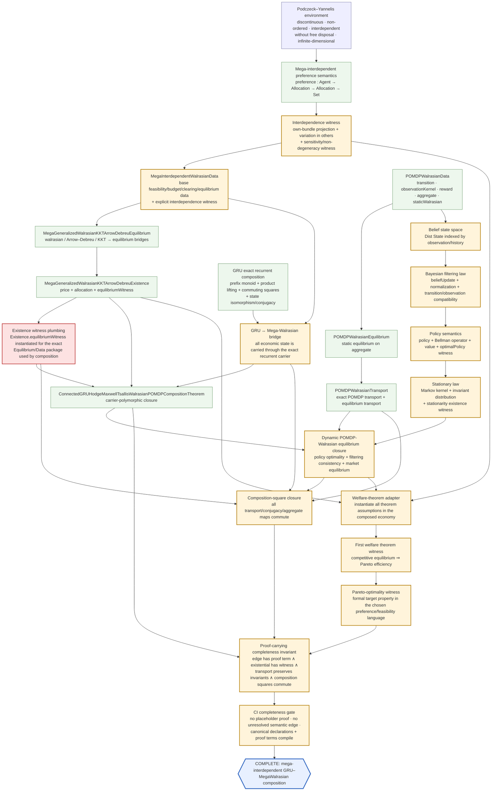

# Mega-interdependent GRU–MegaWalrasian composition completeness

The terminal node is the required end state; the yellow/red nodes are the semantic proof obligations that must be discharged before the graph can legitimately be marked complete.
