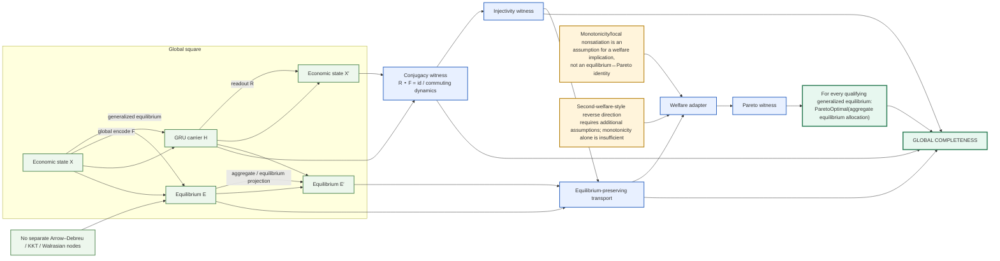

# Mega-interdependent GRU–MegaWalrasian global-square completeness



## Completion invariant

[
mathrm{Complete}
iff
egin{array}{l}
	ext{every square has a proof of commutation/conjugacy,}\
	ext{every encoded carrier map needed for recovery is injective,}\
	ext{equilibrium transport preserves the generalized equilibrium predicate,}\
	ext{the welfare assumptions are instantiated, and}\
	ext{the resulting Pareto witness is transported to the composed object.}
end{array}
]

The economic direction is deliberately one-way at the First Welfare Theorem stage:

[
mathrm{Equilibrium}landmathrm{WelfareAssumptions}
Rightarrow
mathrm{ParetoOptimal}.
]

It is not encoded as

[
mathrm{Equilibrium}iffmathrm{ParetoOptimal}
]

unless a separate reverse theorem and its assumptions are formally supplied.


## Formal Agda contract

The canonical theorem surface now contains these exact nodes:

- `MegaWalrasianGlobalSquareConjugacy`: one global encode/readout square, one state-step conjugacy law, and one equilibrium-square law.
- `megaWalrasianGlobalSquare-injective`: injectivity derived from the readout-left-inverse law.
- `MegaWalrasianEquilibriumWelfareAdapter`: welfare is an explicit implication layer, not an identity with equilibrium.
- `MegaInterdependentGRUMegaWalrasianGlobalSquareCompositionCompleteness`: packages square commutation, injectivity, equilibrium transport, welfare transport, and the final Pareto witness.
- `ConnectedGRUHodgeMaxwellTsallisWalrasianPOMDPCompositionTheorem`: consumes the single `MegaGeneralizedWalrasianEquilibrium` relation; it does not reintroduce separate Arrow–Debreu/KKT/Walrasian predicates.

The square is therefore:

```text
Economic X --encode--> GRU H
    |                    |
    | equilibriumMap     | carrierEquilibriumMap
    v                    v
Equilibrium E =========== E
    ^                    ^
    |                    |
 readout            equilibriumSquare
    |                    |
    +-------- X <--------+

encode ∘ economicStep = gruStep ∘ encode
readout ∘ encode = id
=> encode is injective
```

The completeness contract is intentionally conditional: the Agda object records the exact witnesses supplied by the caller. It does not manufacture existence, welfare assumptions, Bayesian filtering, policy optimality, or Pareto optimality from the graph topology alone.

For welfare, the encoded direction is:

```text
Equilibrium + WelfareAssumptions -> ParetoOptimal
```

not an automatic equivalence. Demand-side monotonicity/local nonsatiation may be among the supplied welfare assumptions, but monotonicity alone does not create the reverse implication.


## Pareto-optimality conditionality contract

The canonical theorem layer now separates the exact logical core of the First Welfare Theorem from the stronger economic assumptions used to discharge it.

```text
ParetoImprovement(b,a)
  = feasible(b)
  + weaklyBetter(i,b,a) for every i
  + strictlyBetter(i,b,a) for some i

First-Welfare conditions
  equilibrium(p,a)
  feasible(a)
  no strictly preferred affordable alternative
  every Pareto improvement is affordable for a strictly improving agent
             |
             v
       ParetoOptimal(a)
```

The resulting `megaFirstWelfareTheorem` is a genuine contradiction proof: the strictly improving agent's affordable bundle is prohibited by equilibrium demand optimality. This avoids treating monotonicity or local nonsatiation as a magical algebraic identity.

The reverse direction is separately represented by `MegaSecondWelfareTheoremConditions`: a Pareto-optimal allocation must come with an explicit supporting-price/redistribution witness that makes it an equilibrium. The resulting `megaSecondWelfareTheorem` produces that supporting price and equilibrium witness.

Thus the equality claim is conditional on two independent directions:

```text
First direction:
  FirstWelfareConditions
    -> Equilibrium -> ParetoOptimal

Second direction:
  SupportingPrice/RedistributionConditions
    -> ParetoOptimal -> Equilibrium

Only when BOTH witnesses are supplied:
  Equilibrium <-> ParetoOptimal
```

In particular, monotonicity/local nonsatiation is not encoded as sufficient for equality. Standard welfare-theorem presentations use local nonsatiation (with market/budget structure) for the first direction, while reverse implementation additionally requires conditions such as continuity, convexity/separation, and an appropriate redistribution/endowment mechanism.

The global-square composition therefore carries `welfareAdapter` as an explicit implication and `completenessWitness` as its instantiated Pareto result. It does not manufacture either welfare direction from the GRU conjugacy or equilibrium square.


## Second-Welfare algebraic boundary

The reverse welfare edge is now explicitly split into a conditional theorem and a non-derivability witness:

```text
ParetoOptimal(a)
  + supporting-price / redistribution witness
        -> Price
        -> Equilibrium

ParetoOptimal(a) alone
        -/-> supporting price
```

The source record `MegaSecondWelfareTheoremBoundaryCounterexample` instantiates the negative edge with:
- Price = empty type
- Allocation = unit type
- ParetoOptimal = inhabited at the chosen allocation
- Equilibrium = empty relation

Hence no term can be constructed for a supporting price at that Pareto-optimal allocation. This establishes only the boundary of the repository's generalized contract; it does not refute the classical theorem, whose missing proof ingredients are economic structure and a separation/supporting-price argument.

The First-Welfare demand clause is likewise classified as demand optimality, not as monotonicity/LNS. The current Agda proof uses it directly because that is the exact proposition needed for the contradiction. Whole-allocation interdependence and heterogeneous preference profiles remain orthogonal generalizations of the preference domain/profile space.
