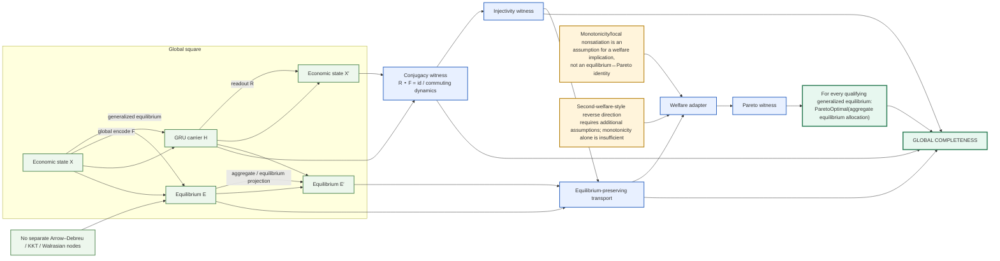

# Mega-interdependent GRU–MegaWalrasian global-square completeness

## Completion invariant

[
mathrm{Complete}
iff
egin{array}{l}
	ext{every square has a proof of commutation/conjugacy,}\
	ext{every encoded carrier map needed for recovery is injective,}\
	ext{equilibrium transport preserves the generalized equilibrium predicate,}\
	ext{the welfare assumptions are instantiated, and}\
	ext{the resulting Pareto witness is transported to the composed object.}
end{array}
]

The economic direction is deliberately one-way at the First Welfare Theorem stage:

[
mathrm{Equilibrium}landmathrm{WelfareAssumptions}
Rightarrow
mathrm{ParetoOptimal}.
]

It is not encoded as

[
mathrm{Equilibrium}iffmathrm{ParetoOptimal}
]

unless a separate reverse theorem and its assumptions are formally supplied.
