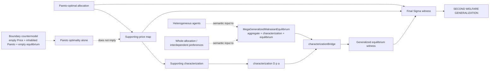

# Generalized Second Welfare theorem graph



The theorem `megaSecondWelfareGeneralized` has two distinct inputs after Pareto optimality. `supportingPrice` produces a price only. `supportingCharacterization` then proves that the generalized characterization holds at that price and allocation. Only after that characterization witness is available does `characterizationBridge` produce the actual equilibrium witness.

The final result is therefore:

```
ParetoOptimal a
      |
      +--> supportingPrice --> p
      |
      +--> supportingCharacterization --> characterization D p a
                                           |
                                           | characterizationBridge
                                           v
                                      equilibrium D p a

(p, equilibrium D p a)
          |
          v
Sigma Price (lambda p -> equilibrium D p a)
```

The graph intentionally does not draw `supportingPrice -> equilibrium`. That would be an incorrect dependency: a price is not itself an equilibrium proof.

The heterogeneous-agent and whole-allocation/interdependent-preference nodes are shown as dotted semantic inputs to the generalized equilibrium record, not as direct arguments of `megaSecondWelfareGeneralized`. They are not theorem dependencies unless an explicit Agda construction feeds those semantics into `MegaGeneralizedWalrasianEquilibrium`.

The existing boundary countermodel remains a separate non-derivability result: Pareto optimality alone does not imply the existence of a supporting price or equilibrium witness on the unconstrained generalized surface. This is a boundary of the formal contract, not a refutation of the classical Second Welfare Theorem under its additional economic assumptions.
