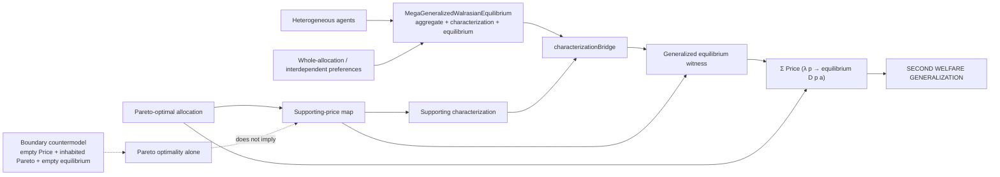

# Generalized Second Welfare theorem graph

The theorem `megaSecondWelfareGeneralized` uses the single generalized Walrasian relation. The supporting-price step is the economic separation input; once it supplies a price and the generalized characterization, `characterizationBridge` derives the actual equilibrium witness.

This is stronger than merely packaging `supportingEquilibrium`: equilibrium is obtained from the generalized characterization surface. Heterogeneous and whole-allocation/interdependent preference semantics remain inside the generalized object.

The graph does not claim that Pareto optimality alone generates a supporting price. The existing boundary countermodel remains the formal non-derivability result for that weaker premise.