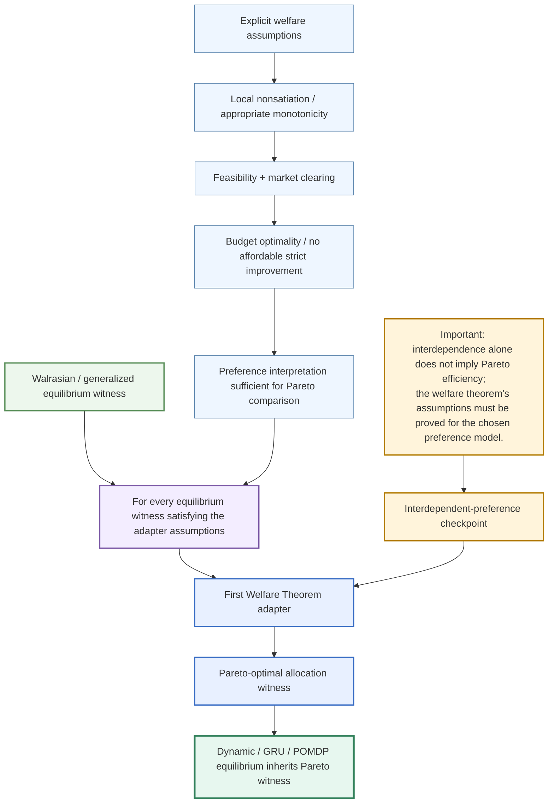

# Welfare-first completion spine

This is the first completion path for the mega-interdependent GRU–MegaWalrasian composition.

The formal target is:

[
orall,p,a,; operatorname{WalrasianEq}(p,a)
land operatorname{WelfareAssumptions}(p,a)
	o
operatorname{ParetoOptimal}(a).
]

For the dynamic composition, the final bridge should quantify over the dynamic equilibrium witness and prove that its static/economic projection satisfies the same assumptions before transporting Pareto efficiency back to the composed object.
