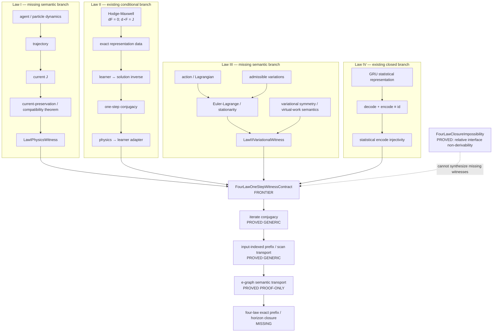

# Repository Wiki — current semantic state

This page is the compact knowledge layer for the current repository state. It replaces the stale historical narrative with the semantics that are actually present on `main`.

## What the project proves

The canonical learner is a coupled recurrent state machine. Its exact definitions expose:

- recurrent state and scan composition;
- Watkins state and endogenous target construction;
- F4/L2 optimizer state;
- LCB counts and sparse policy readout;
- q-log control/value state;
- preserved `NormPair`;
- exact clock growth;
- integer-token recurrent processing;
- exact linear Haar mixing.

The theorem monolith derives exact structural consequences from those definitions.

## What emerges without extra economic assumptions

The current closed theorem core establishes:

- exact recurrent composition laws;
- state-isomorphism/transport interfaces;
- absence of nontrivial finite cycles for the full canonical state;
- `NormPair` preservation;
- `NormPair` quotient/factor transition;
- policy and transition factorization through that quotient;
- exact F4 optimizer stability;
- an exact F4 unit-forcing growth ray;
- no unconditional infinite-horizon upper bound for that F4 quantity;
- a closed singleton generalized-Walrasian empty-equilibrium countermodel.

The central composition theorem is `CanonicalF4NormPairUnconditionalFactorStabilityTheorem`.

## What does not emerge automatically

None of the learner-side results alone proves:

- convergence;
- existence of a fixed point;
- market clearing;
- a supporting/derived price;
- generalized Walrasian equilibrium existence;
- Arrow–Debreu existence;
- First Welfare or Second Welfare conclusions without their economic hypotheses.

This is a semantic boundary, not a missing “final theorem.” The absence is intentional and is supported by the closed countermodel and by the exact non-fixed-point clock law.

## MARL-facing laws and injectivity

The repository now graphs four law layers explicitly:

- Law I: agent/particle dynamics and particle trajectories/current;
- Law II: Maxwell field dynamics, represented through the carrier-polymorphic Hodge-Maxwell surface;
- Law III: variational/virtual-work admissibility;
- Law IV: canonical GRU statistical representation.

Law I and Law III have graph-level exact representation/injectivity surfaces that are explicitly conditional on inverse representation witnesses. They are not claimed as unconditional physics injectivity theorems.

Law II has an actual Agda injectivity consequence through `ConnectedContinuousHodgeMaxwellGRURepresentationTheorem`: its encode/decode inverse laws yield encoder injectivity. Law IV has an actual closed Agda theorem, `CanonicalGRUStatisticalInjectivityTheorem`, with decode∘encode and a derived injectivity proof.

The four injectivity surfaces therefore remain faithful to the proof boundary: graph edges do not create missing physical representation witnesses.

Law IV now also has an arithmetic-free carrier-polymorphic representation kernel in `Exotic/ERL/FullCoupled/TsallisStatisticalRepresentation.agda`. The generic injectivity result requires only an encoder, decoder, and `decode ∘ encode ≡ id`; it does not import `Real`, `Rational`, `Vec`, or `Fin n`. The canonical GRU observation is instantiated through `TsallisCompatibleStatisticalRepresentation`. This generalizes the proof surface without rewriting the concrete learner's existing `FiniteRational` q-log state. The name `TsallisCompatible` is a structural interface, not a claim that the Tsallis website itself is an Agda proof dependency.

Law IV's statistical representation is distinct from the additional ZPF hypothesis. The ZPF layer may state a homogeneous/isotropic stochastic field and an `ω³` spectral law, but that spectral hypothesis is not derived from Maxwell equations or from injectivity.

## Primary-source closure audit

External references sharpen the missing-witness boundary rather than removing it.

The nLab treatment of Noether's theorem makes the Law-III requirements explicit: stationary action, admissible boundary behavior for variations, Euler-Lagrange equations, and variational symmetries/conserved currents. These formalisms therefore identify the data a concrete Law-III witness must carry; they do not provide a universal learner-to-variational-state inverse.

For Law I, nLab's Maxwell treatment formulates the source as a current and uses differential-form equations such as `d F = 0` and `d * F = j`. That validates the current/Maxwell interface but does not by itself construct the repository's required trajectory/current-preservation witness.

The Tsallis source establishes the q-entropy and q-distribution formalism under explicit statistical constraints. It supports the repository's statistical layer, but it does not supply a physical-state encode/decode inverse or the physics-to-learner transition conjugacy.

Accordingly the exact continuation remains:

```text
Law-I trajectory/current
        |
        +--> current-preservation theorem
        |        |
        |        v
        |   Law-I witness [MISSING]
        |
Law-III action/Lagrangian + admissible variations
        |
        +--> Euler-Lagrange / stationarity
        +--> variational symmetry / virtual-work semantics
                 |
                 v
            Law-III witness [MISSING]

Law-II Hodge-Maxwell representation
        |
        +--> physics → learner transition [PROVED CONDITIONAL]
        |
        v
FourLawOneStepWitnessContract [FRONTIER]
        |
        v
n-step iterate transport [PROVED GENERIC]
        |
        v
prefix / horizon transport [PROVED GENERIC]
        |
        v
e-graph semantic transport [PROVED PROOF-ONLY]
        |
        v
four-law exact prefix / horizon closure [MISSING]
```

No external source is promoted to Agda proof authority. The detailed source audit is recorded in `docs/research/four-law-primary-source-closure-audit-2026-09-25.md`.

## Why Mermaid, and what it is not

Mermaid is a diagram-description DSL, not a pure typed functional programming language. A flowchart source names nodes, edges, labels, subgraphs, and presentation/layout directives; the Mermaid parser and renderer turn that declarative description into a diagram. It has no role as proof authority and does not replace Agda's type system. Mermaid fits this repository because the topology is a human-readable graph projection that fits Markdown/GitHub documentation.

## What the F4 ray actually says

The F4 ray theorem is an exact statement about the implemented discrete update under a specified persistent forcing pattern: the selected integer-valued optimizer coordinate advances by a fixed nonzero increment, hence grows linearly with the horizon. It is not a theorem that “F4 is an optimizer that diverges,” and it is not a convergence result in the opposite direction.

## Production-side topology

The production-side contract uses standard economic vocabulary.

## Four-law closure frontier

The repository now has an explicit typed contract for the remaining cross-law witness seam in `Exotic/ERL/FullCoupled/FourLawClosureWitnesses.agda`.

`LawIPhysicsWitness` requires a learner-to-physical representation with a left inverse plus explicit trajectory/current data. `LawIIIVariationalWitness` requires an inverse representation plus explicit admissibility and stationarity predicates. `PhysicsToLearnerTransitionWitness` requires an inverse representation and one-step transition conjugacy. The theorem monolith derives `canonical-physics-to-learner-transition-witness` directly from `CanonicalLearnerHodgeMaxwellCompositionTheorem`, so this transition seam is an explicit adapter rather than a second independently invented witness.

These records are deliberately uninhabited on the current branch. They make the missing proof obligations machine-readable without turning semantic contracts into axioms. The graph therefore records `FourLawOneStepWitnessContract` as a frontier contract, not as a closed theorem.

The remaining promotion path is:

```text
Law-I witness + Law-III witness + physics→learner conjugacy
        ↓
existing Law-II Hodge-Maxwell representation
        +
existing Law-IV GRU statistical representation
        ↓
four-law one-step square
        ↓
iterate / prefix / horizon transport
        ↓
strict connected closure
```

No unconditional four-law closure is claimed until that contract has an actual Agda inhabitant and the composed theorem passes the repository's proof and CI gates.

## Relative impossibility boundary

The repository now contains `Exotic/ERL/FullCoupled/FourLawClosureImpossibility.agda`. It proves a constructive relative non-derivability result: there is no polymorphic constructor from arbitrary carriers, admissibility predicates, stationarity predicates, and one-step functions to `FourLawOneStepWitnessContract`.

The proof specializes `Stationary` to the empty type. Any universal constructor would therefore have to populate the `LawIIIVariationalWitness.stationary` field for an inhabited physical carrier, yielding an inhabitant of `⊥`. This is an impossibility of the generic interface, not an impossibility theorem about concrete physics or about every possible four-law model.

Consequently the iterate/prefix transport kernels cannot close the frontier by themselves: they transport an inhabited semantic square. A concrete closure theorem still requires genuine Law-I and Law-III semantic data, or explicit additional assumptions from which those data are derived.

## Four-law semantic closure graph — current frontier

The graph below is the canonical human-readable projection of the typed proof boundary. Labels mean: **PROVED** = an Agda theorem/adapter exists; **CONDITIONAL** = follows from explicitly supplied representation semantics; **MISSING** = the repository has a contract but no concrete semantic witness; **FRONTIER** = the composition is blocked at that seam.

The graphical decomposition now makes the two missing semantic branches explicit:

1. **Law I:** trajectory/current data must be connected to a theorem such as `current (trajectory p) ≡ current p` (or an equivalent concrete conservation/compatibility statement) before `LawIPhysicsWitness` can be inhabited.
2. **Law III:** an actual action/Lagrangian, admissible variations, and stationarity/Euler–Lagrange or equivalent virtual-work semantics must be supplied before `LawIIIVariationalWitness` can be inhabited.
3. **Physics → learner:** this edge is no longer a missing generic contract: `canonical-physics-to-learner-transition-witness` is an existing conditional adapter derived from the canonical Hodge-Maxwell/learner composition.
4. **Transport:** iterate, prefix-scan, and e-graph kernels transport an already-inhabited semantic square; they do not synthesize Law-I or Law-III semantics.



The semantic bottleneck is therefore not GRU expressivity. It is the construction of concrete Law-I and Law-III witnesses that preserve the intended meanings of those laws. Adding arbitrary axioms would make the endpoint conditional on those axioms; changing the law definitions to fit the GRU would change the theorem being proved.

nLab's Maxwell and variational formalisms provide the mathematical vocabulary for these missing branches, but external references are not proof authority. The repository must still supply the actual Agda witnesses and their connection to the canonical learner.
